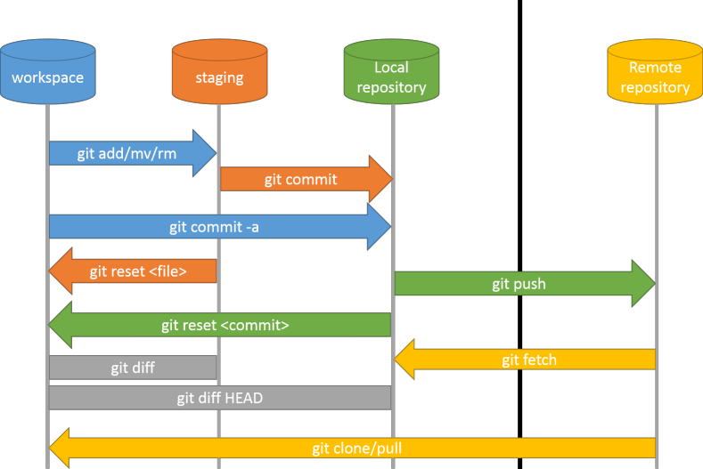

<h1>TechnoBytes</h1>

 

 
 

*29/04/2014*

---
= data-x='1000'
>##  Github

### **Généralités:**
* Service web d'hébergement utilisant Git
* Fondé en 2008
* Chris Wanstrath, PJ Hyett et Tom Preston-Werner
* Basé à San Francisco
* 239 *Hubbernauts*
* Ecrit en RoR et Erlang
* N° 1 dans l'hébergement de projets libres (RoR, jQuery, etc.)

---
= data-y='1000'
>##  Github

### **Github propose:**
* L'hébergement de projets sous Git
* Des fonctionnalités de type réseaux sociaux, dont:
 * les flux,
 * le suivi de personnes ou de projets,
 * les graphes de réseau pour les dépôts
* Un pastebin nommé Gist
* Un wiki, un logiciel de suivi de problèmes et une page web pour chaque dépôt
* Des Webhooks pour l'intégration avec d'autres services.

### **Business model:**
* Comptes professionnels payants (privé)
* Comptes gratuits pour les projets open source (publique)

---
= data-y='1000'
>##  Github

### **Les manques par rapport aux concurrents:**
* Des fonctionalités (mailing list, forum, project manager, etc.), mais rattrapées par les webhooks
* Dépôts privés gratuits (e.g. GitLab)

---
= data-x='1000' data-scale='2'
>##  Git

### **Généralités:**
* Logiciel de gestion de versions **décentralisé** (SCM)
* Première version le 7 avril 2005
* Linus Torvalds, Junio Hamano et contributeurs
* Ecrit en C, Bourne Shell et Perl
* Licence GPL2

---
= data-x='1000'
>##  Git

### **Gestion de versions, SCM, kesako ?**
* SCM: Source Code Management
* Définition: Permet de stocker un ensemble de fichiers en conservant la chronologie de toutes les modifications qui ont été effectuées dessus par les développeurs. Il permet notamment de retrouver les différentes versions d'un lot de fichiers connexes.
 * Stocke/trace l'évolution du code source
 * Gère les mises à jour des sources pour chaque développeur
 * Fusionne les copies locale et distante
 * Aide au versioning des livrables

---
= data-x='1000'
>##  Git

 
 

---
= data-x='1000'
>##  Git

### **Pourquoi Git ?**
* Track du contenu plutôt que des fichiers
* Des Hooks pour contrôler les actions du developpeur
* Totalement décentralisé, donc tolérant aux panes
 * Le code peut être réparti sur plusieurs dépôts (un local et plusieurs distants)
 * Très performant car il y a de multiples dépôts

---
= data-x='1000'
>##  Git

### **Pourquoi Git ? next**
* Permet de gérer des milliers de collaborateurs sur des petits ou des très grands projets
* Permet de faciliter le travail à distance (dixit Linus)
* Permet de créer/fusioner des branches facilement et rapidement

 
"Safe, very fast, distributed" by Linus

 
NB: Mercurial a globalemment une approche similaire à Git.

---
= data-x='1000'
>##  Git

* GUI dédié: Git Extentions, Git-Cola, etc.
 * mais aussi pour Netbeans, Sublime Text, Vim, etc.
 * Oh my ZSH \o/ (terminal)

---
= data--x='1000'
>##  Git

### **How does it work ?**

Et encore plein d'autres fonctionalitées...

---
= data-x='1000'
>##  Git

**Ignorer des dossiers/fichiers**

.gitignore à la racine du dépôt:

    *.gem

    # Ignore all logfiles and tempfiles.
    /log/*.log
    /tmp

    # Ignore generic swap files
    *.so
    *.out
    *~
    *.DS_Store

    # Ignore NetBeans files
    /nbproject/

---
= data-x='1000'
>##  Git

###**Gestion des branches**
*Structure de base:*

    master        A---B
    --                |
    stable        A---B
    --                |
    staging       A---B

---
= data-x='1000'
>##  Git

###**Gestion des branches**
*Proposed updates, topics:*

    master        A---B
    --                |
    stable        A---B
    --                |
    staging       A---B
    --                 \
    pu-sept_2014        B
    --                   \
    tp-user               B---E---F---G 
    --                     \
    tp-versioning           M---N

---
= data-x='1000'
>##  Git

###**Gestion des branches**
*Merge (Pull Request):*

    pu-sept_2014        B---------------H------------K
    --                   \             / \          /
    tp-user               B---E---F---G   \        /
    --                     \               \     /
    tp-project              \               I---J
    --                       \
    tp-versioning             M---N

---
= data-x='1000'
>##  Git

###**Gestion des branches**
*Rebase (délégation de correction de conflits):*

    pu-sept_2014  B---H---K
    --             \
    tp-versioning   M---N

Conflits de fusion entre tp-versioning et les commits H et K

    git checkout tp-versioning
    git fetch
    git rebase -p pu-sept_2014
 

    pu-sept_2014  B---H---K
    --                     \
    tp-versioning           M'---N'

Reuse recorded resolution

    git config --global rerere.enabled true

---
= data-x='1000'
>##  Git

### **Gestion des fix:**

    master        A---B
    --                |
    stable        A---B-------B'
    --                |\     /
    fix-utf8          | C---D  
    --                |
    staging       A---B

---
= data-x='1000'
>##  Git &  Github

### **Merci**

 

### **Liens**
* [Git SCM](http://git-scm.com/)
* [Tech Talk: Linus Torvalds on git](http://www.youtube.com/watch?v=4XpnKHJAok8)